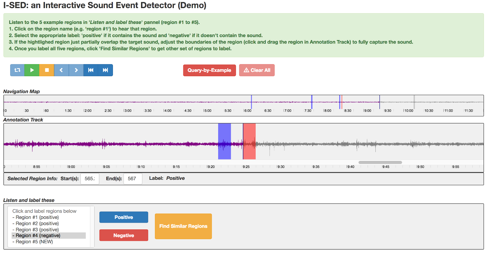

# I-SED: Interactive Sound Event Detector

*NOTE: I-SED was developed in 2017 as a proof-of-concept for a user study of a research paper and built with very shallow knowledge of web-development. Therefore, it is not ready to be used for other purposes and the code is very disorganized. However, you can still run the app and test the main concept of the interactive sound event annotation. I also believe some components of this app are quite useful to people who want to build a sound event annotator.*

---
## Description
I-SED is a human-in-the-loop interface for sound event annotation that helps users search for sound events of interest within a lenghty recording quickly. How a user interects with the interface is following:

1. A user selects a sound event of interest in a long recording
2. The interface returns a set of regions conaining sound events similar to the initial user selection.
3. The user listens to each of them and label them (positve or negative). 
4. Based on the label information, the interface suggests another set of regions in the recording.


Screenshot:



---
## Demo video: [YouTube video](https://youtu.be/Ss2eGSW4_4w)

More details about the interaction can be found on the following project pages: [https://www.bongjunkim.com/pages/projects/ised.html](https://www.bongjunkim.com/pages/projects/ised.html)


---
## Citation
When used in academic works, please cite the following paper:
>Bongjun Kim and Bryan Pardo, “A Human-in-the-loop System for Sound Event Detection and Annotation,” ACM Transaction on Interactive Intelligent System (TiiS), Vol. 8, Issue 2, Article 13, July 2018.


## To run the app


```shell
python run.py
```